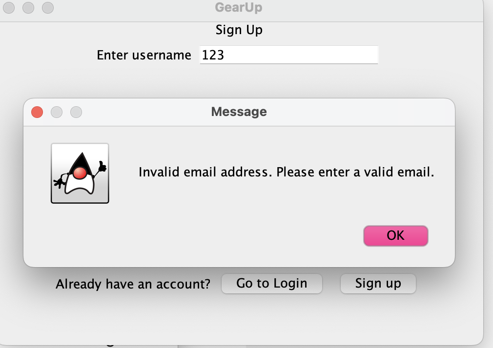
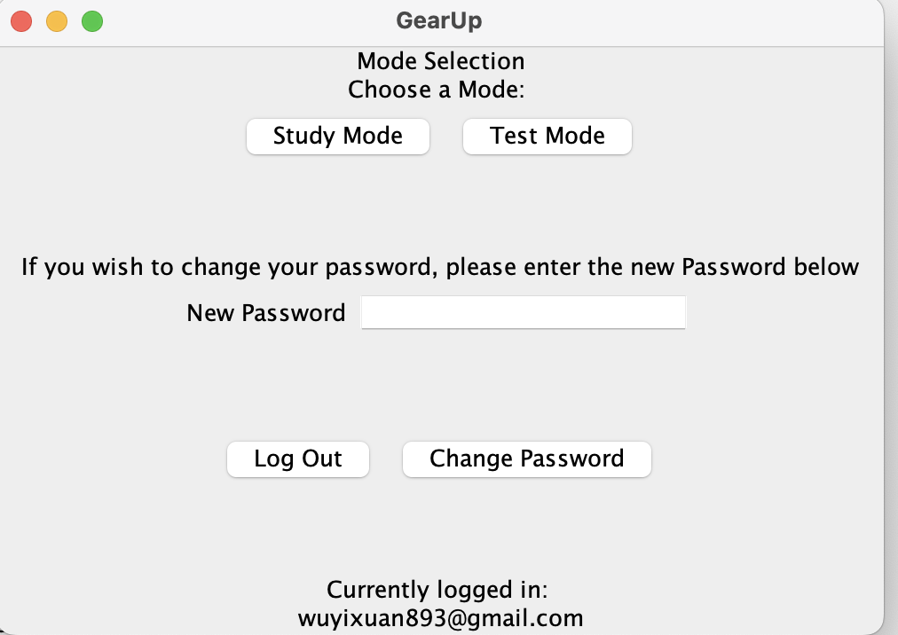
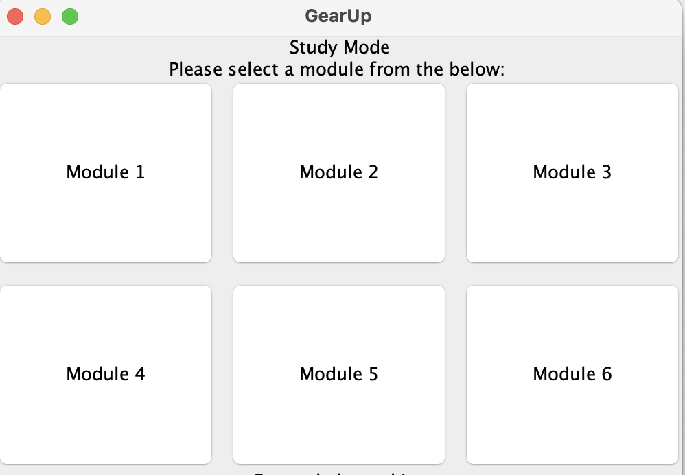
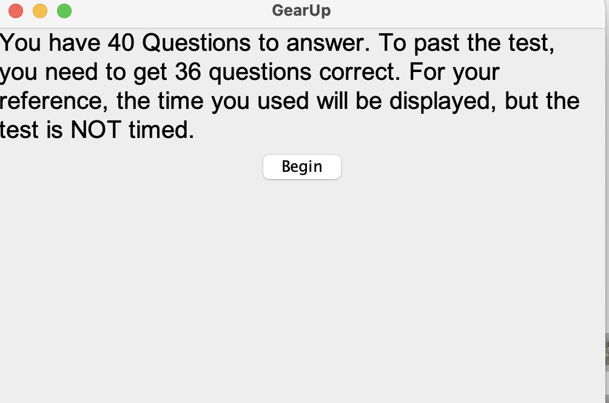
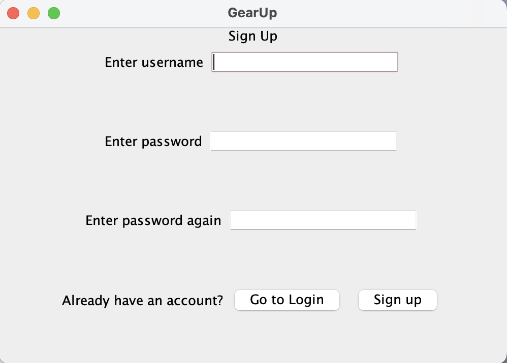

# **CSC207 Final Project: G1 Preparation Tool - Gear Up**

## Authors and Contributors

- **Kimberly Fu** - *Quiz Feature*  
  [Kimberly GitHub page](https://github.com/KiiimFU)

- **Yixuan (Amelia) Wu** - *Mode Selection & Result Display Feature*  
  [Yixuan's GitHub page](https://github.com/amiwu421)

- **Yanting (Clara) Fan** - *Test Mode & Study Mode*  
  [Yanting's GitHub page](https://github.com/faenwitee)

- **Zixiang (Terry) Huang** - *API & Database & app visualization*  
  [Zixiang's GitHub page](https://github.com/trrrrrrry)

## Overview
This program is designed to help users effectively prepare for their G1 driving test by offering a variety of practice options. Users can learn at their own pace by practicing individual topics through different modules. In addition to module-specific practice, users can simulate full G1 test experiences using our mimic test feature, which replicates the real test environment with randomized questions.

By offering both focused learning and realistic test simulations, this program provides a comprehensive way for users to build their confidence and knowledge, ensuring they are well-prepared to succeed in their G1 test.

## Table of Contents
1. [Author and Contributors](#authors-and-contributors)
2. [Overview](#overview)
3. [Table of Contents](#table-of-contents)
4. [Features](#features)
5. [Installation instructions](#installation-instruction)
6. [Usage Guide](#usage-guide)
7. [License](#license)
8. [Section for Feedback](#section-for-feedback)
9. [Contribution Guidelines](#contribution-guidelines)

## Features
* **Personalized Account (API)**: Personalized account for each use with valid email address. Invalid Email will be rejected as shown below. 

* **Flexible Study Methods**: Provide Study Mode and Test Mode for the user to flexibly choose their study plan.

* **Modular Learning (Study Mode)**: Practice questions through modules in Study Mode, which ensure the study process is more achievable.

* **Mimic Test Feature (Test Mode)**: Simulate a full G1 test in Test Mode, with randomized 40 questions to experience real test conditions.

* **Progress Tracking (Test Result)**: Keep track of your incorrect questions which allows users to review their progress.
* **User-Friendly Interface**: Designed for easy navigation and intuitive learning, making preparation accessible for everyone.

## Installation Instruction
### Step 1: To Install this project, users are required to download specific packages and software if they haven't done. 
**Package and Software that need to be downloaded - IntelliJ**
- [Installation Guidelines for IntelliJ](https://www.jetbrains.com/help/idea/installation-guide.html)

**Required Vision - Version 17 JDK**
- [Install Java with Version 17 JDK](https://www.jetbrains.com/help/idea/sdk.html#manage_sdks)

**Install Git**
- [Install Git](https://git-scm.com/downloads)
- [How to enable git integration](https://www.jetbrains.com/help/idea/enabling-version-control.html)

**Get a GitHub Account**
- [Instruction for Signing Up a GitHub Account](https://education.github.com/pack)

**Common Issues of Installation**
When cloning our program to the downloaded IntelliJ, users may be required to authenticate GitHub account on their InterlliJ if they haven't done. The following link is the instruction for authenticating GitHub account on IntelliJ.
- [Authenticate GitHub account on IntelliJ](https://www.jetbrains.com/help/idea/github.html)

### Step 2: After downloading required software and packages, users now can clone install our project following the steps below. 
1. Copy the following link
> https://github.com/faenwitee/GearUp.git
2. Click "Get from Version Control" on the top right corner
3. Paste the above link and click "clone"
4. locate the file named "main"
5. Run the file

## Usage Guide
* After locating and running the file named "main", user now can sign up for a personal account using a valid email address. 

* Then user may choose either study or test mode to aid their study.

* Following the instruction for each mode, user can start studying
* After complete each module or test, user would get a result summary.
* Clicking the "finish" button on the result displaying page would allow user go back to the mode selection page, which allows user to engage again (repeating process with above). 

## License
This project is open source licensed under the MIT License, which allows you to freely use, modify, and distribute the code for personal or commercial purposes, provided that you include the original copyright notice.
See the [LICENSE](LICENSE) file for the full text.

## Section for Feedback
We value your feedback! If you have any suggestions, bug reports, or feature requests, please feel free to open an issue in the GitHub repository. Your input will help us improve and make the G1 Test Preparation Program even better.

## Contribution Guidelines
We welcome contriutions from you to enhance the program! If you're interested in contrubuting, please follow these steps:
1. **Fork the Repository**: Create a copy of the repository in your own GitHub account.

2. **Create a Branch**: Make a new branch for your feature or bug fix.

    >git checkout -b feature/your-feature-name

3. **Make Changes**: Add your changes or improvements to the code.

4. **Write Tests**: If applicable, write tests to ensure that your changes work as expected.

5. **Commit Changes**: Commit your changes with a meaningful commit message. 

    >git commit -m "Add your meaningful commit message here"

6. **Push the Branch**: Push your changes to your forked repository.

    >git push origin feature/your-feature-name

7. **Open a Pull Request**: Create a pull request from your branch to the main repository.

8. **Review**: Wait for a review and make any requested changes.
